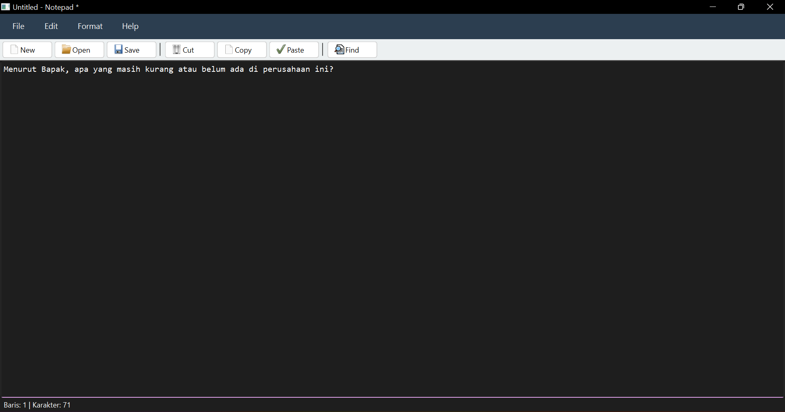
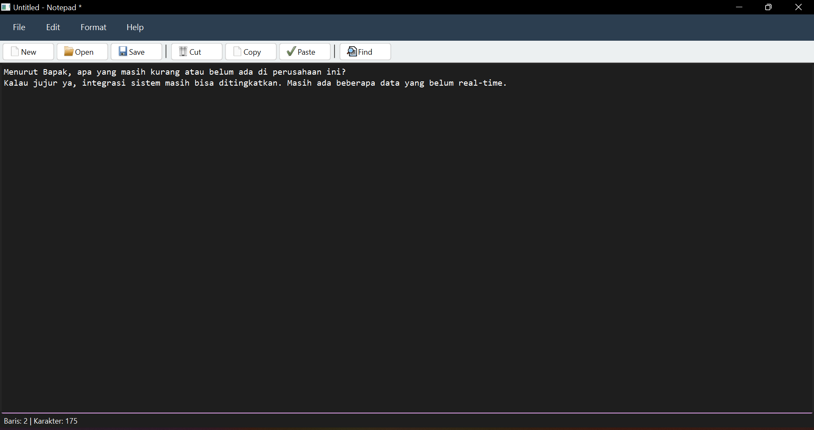
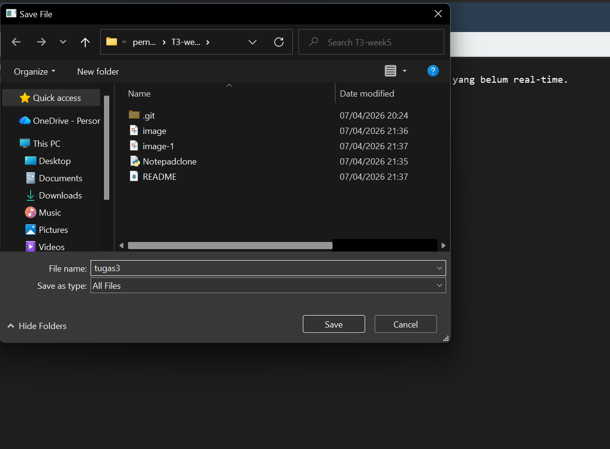
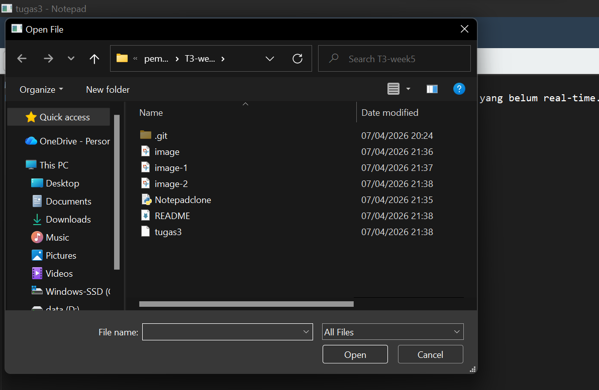
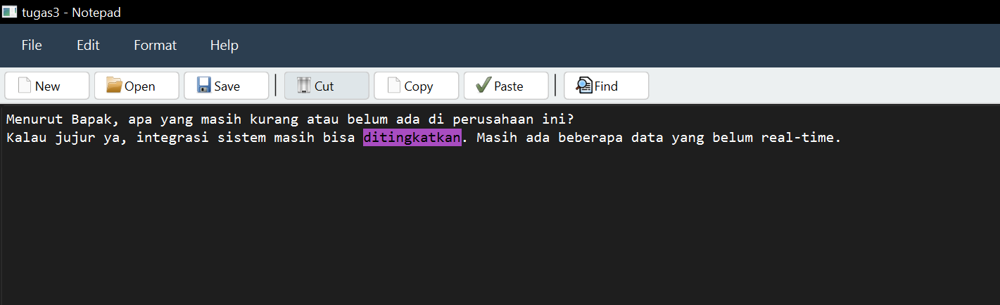
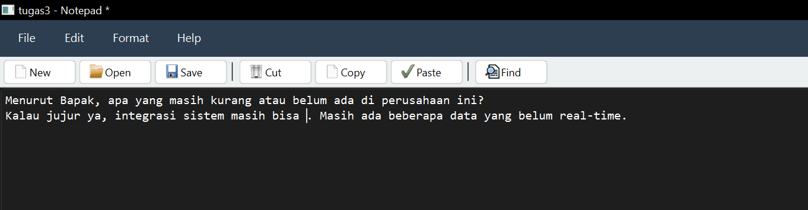
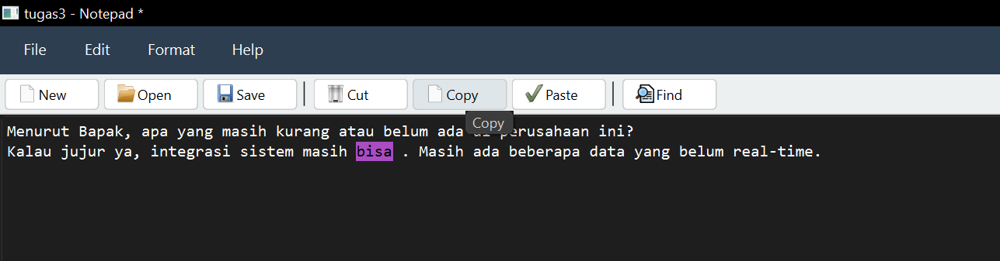
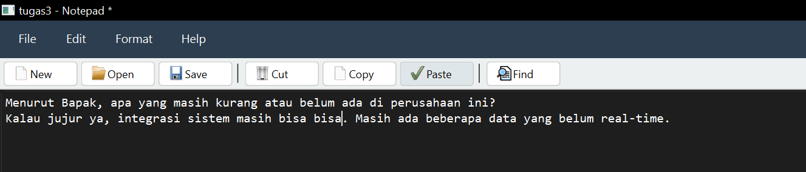
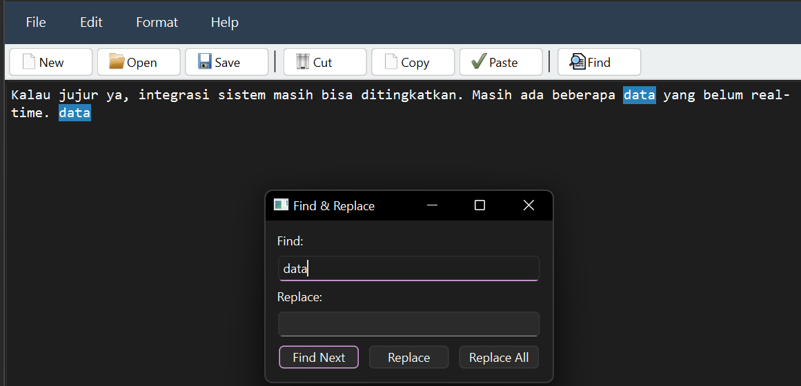
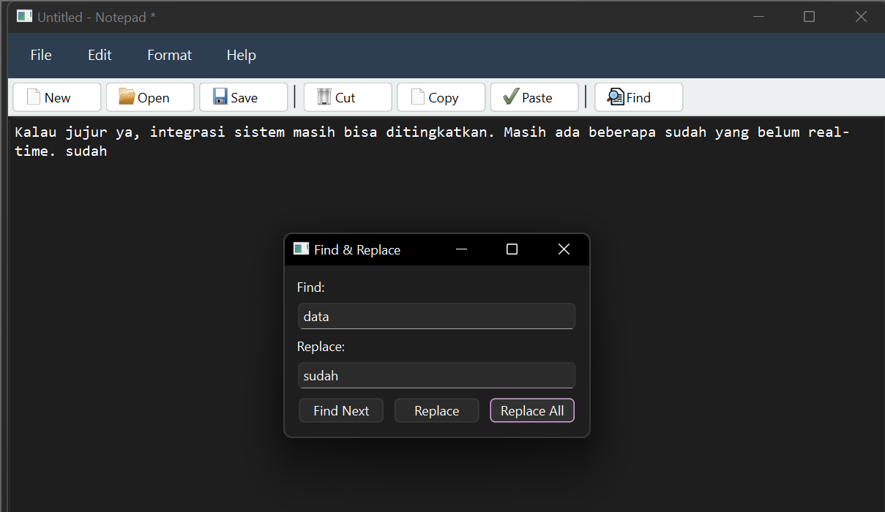

# T3-week5
<h3>Gambar 1</h3>

  

<em>baris 1 dengan karakter 71</em>

  

<em>baris 2 dengan karakter 175</em>

<h3>Gambar 3</h3>

  

<em>save file dengan file name tugas3</em>

<h3>Gambar 4</h3>

  

<em>open file</em>

<h3>Gambar 5</h3>

  

<em>cut kata"ditingkatkan"</em>

<h3>Gambar 6</h3>

  

<em>kata "ditingkatkan" hilang</em>

<h3>Gambar 7</h3>

  

<em>copy kata "bisa"</em>

<h3>Gambar 8</h3>

  

<em>paste kata "bisa"</em>

<h3>Gambar 9</h3>

  

<em>find kata "data"</em>

<h3>Gambar 10</h3>

  

<em>replace dan replace all kata "data" jadi kata "sudah"</em>
